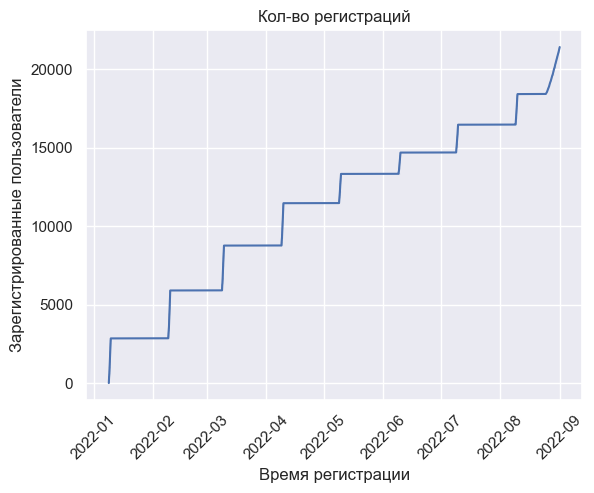
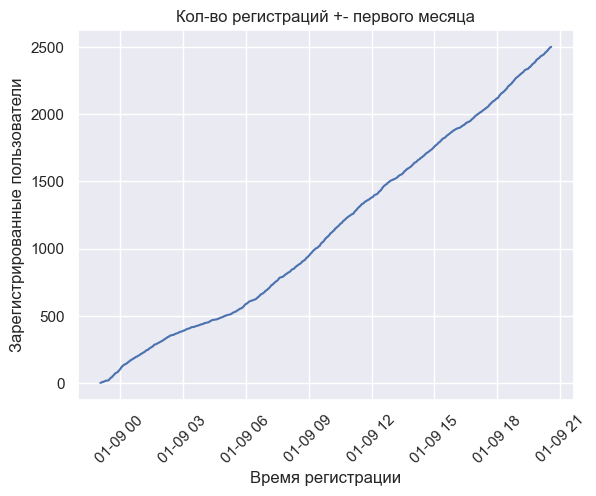

# Предварительные проверки (Python)

Загрузить базовые таблицы в *Jupyter Notebook*  и провести проверки данных на:
* *дубликаты*
* *пропущенные значения*
* *типы данных*
* *общие метрики*
<br>

В файле `analysis.ipynb` корневой папки располагается *Jupyter Notebook*. Ход работы описан в разделах:
* *Импорт датафреймов* (заголовок H1)
* *Предварительные проверки и преобразования* (заголовок H1)

**Краткий итог**: на первый взгляд данные *не имеют* явных *отклонений* и *аномалий*
<br>

---
---

# Блок SQL

> При больших таблицах **Output** с припиской **~** будет отображать часть данных (*пример*: **Output~:**)
>
>**Комментарий в коде SQL типа** `-- xxxxxxxxxxx.csv` указывает на наличие выгруженной таблицы в папке **Modern** (`./CSV/Modern`)

## 1. Базовые запросы

Посчитать:
* *количество пользователей*
```PostgreSQL
SELECT COUNT(DISTINCT user_id) AS number_users
FROM users
```
**Output:**

| number_users |
| ------------ |
| 20331        |
<br>

* *количество заказов*
```PostgreSQL
SELECT COUNT(DISTINCT order_id) AS number_order
FROM orders
```
**Output:**

| number_order |
| ------------ |
| 59595        |
<br>

* *долю отменённых заказов*
```PostgreSQL
WITH

-- Колонка action разбивается на две, что бы в фильтре отсечь аномалии, когда заказ доставлен или отменён, но при этом не был создан
order_history AS (
	SELECT order_id,
	
		   MAX(
			   CASE 
			   WHEN action = 'create_order' THEN 'create_order'
			   END 
		   ) AS start_order,
	
		   MAX(
			   CASE 
			   WHEN action = 'deliver_order' THEN 'deliver_order'
			   WHEN action = 'cancel_order' THEN 'cancel_order'
			   END
		   ) AS end_order
		   
	FROM actions
	
	GROUP BY order_id
	
	ORDER BY order_id
)


-- Нахождение доли отменнёных заказов
SELECT 
		ROUND(
			COUNT(order_id) FILTER(WHERE start_order = 'create_order' and end_order = 'cancel_order') 
			/
			(COUNT(order_id) FILTER(WHERE start_order = 'create_order'))::DECIMAL,
		2)
		AS percent_cancelled_orders
FROM order_history
```
**Output:**

| percent_cancelled_orders |
| ------------------------ |
| 0.05                     |
<br>

* *распределение пользователей по `traffic_source`*
```PostgreSQL
SELECT traffic_source,
	   COUNT(DISTINCT user_id) AS quantity
	   
FROM users

GROUP BY traffic_source
```
**Output:**

| traffic_source | quantity |
| :------------- | :------- |
| ads            | 7035     |
| organic        | 10318    |
| referral       | 2978     |
<br>

* *возраст пользователей* (возраст высчитывается до даты последнего заказа)
```PostgreSQL
-- age_users.csv
SELECT 
		user_id,
		EXTRACT(
			YEAR FROM AGE(
				(SELECT MAX(TO_DATE(event_time, 'YYYY-MM-DD')) FROM events),
				
				 TO_DATE(birth_date, 'YYYY-MM-DD')
			)
		) AS age
FROM users
```
**Output~:**

| user_id | age |
| :------ | :-- |
| 10597   | 44  |
| 4521    | 34  |
| 5778    | 22  |
| 8636    | 19  |
| 15773   | 30  |
| 2181    | 17  |
| 837     | 19  |
| 632     | 52  |
| 11407   | 20  |
| 4744    | 16  |
| ...     | ... |
<br>

* *средний возраст пользователей* (возраст высчитывается до даты последнего заказа)

```PostgreSQL
SELECT 
		ROUND(
			AVG(
				EXTRACT(
					YEAR FROM AGE(
						(SELECT MAX(TO_DATE(event_time, 'YYYY-MM-DD')) FROM events),
						
						TO_DATE(birth_date, 'YYYY-MM-DD')
					)
				)
			)
		) AS avg_age
FROM users
```
**Output:**

| avg_age |
| ------- |
| 34      |


---

## 2. Воронка

### Python анализ

В *Jupyter Notebook*  (раздел: *График зарегистрированных пользователей*, заголовок H1) были рассчитаны и отрисованы **графики регистраций пользователей** за всё время и за первый месяц



Даты первой регистрации в каждом месяце:
- 2022-01-08
- 2022-02-08
- 2022-03-08
- 2022-04-08
- 2022-05-08
- 2022-06-08
- 2022-07-08
- 2022-08-08

Выходит довольно необычный график регистраций. **Рост в течении одного дня**, а затем **полное плато** до момента новой волны регистраций. Подобное поведение можно было бы объяснить **потоковой регистрацией**, когда окно этих самых регистраций открыто в определённый промежуток времени. **Нетипичный подход для Ecommerce**. **Можно предположить, что есть проблемы со сбором данных**. Однако стоит учитывать, что **каждая новая волна начинается 8 числа каждого месяца** и подобные обстоятельства могут действительно **является стратегией** компании. Данная ситуация требует уточнений о природе подобного поведения графика
<br>

### SQL запросы

*Табличные выражения* (общие для раздела и выделенные в отдельное окно):
>В коде находится закомментированный блок:
```PostgreSQL
-- Фильтрация по месяцу
WHERE EXTRACT(MONTH FROM event_time)  = 1 -- изменяемое значение (от 1 до 8)
  AND EXTRACT(DAY   FROM event_time) >= 8
```
>При **раскомментировании и изменении значения в месяце**, можно отфильтровать воронку по этому самому месяцу

```PostgreSQL
WITH

-- Для каждого события пользователя проставляется номер, в порядке которого он встречается во времени (в зависимости от тестируемого месяца меняется и значение в фильтре)
events_modern AS(
	SELECT *

	FROM(
		SELECT 
				event_id,
				user_id,
				event_type,
				TO_TIMESTAMP(event_time, 'YYYY-MM-DD HH24:MI:SS') AS event_time,
				device,
		
				ROW_NUMBER() OVER(PARTITION BY user_id, event_type ORDER BY event_time) AS numb_event_of_user
		FROM events
	) AS t_1
	
	-- -- Фильтрация по месяцу
	-- WHERE EXTRACT(MONTH FROM event_time)  = 1 -- изменяемое значение (от 1 до 8)
	--   AND EXTRACT(DAY   FROM event_time) >= 8

),

counting_event AS(
	SELECT 
			device,
			traffic_source,
	   		event_type,
	   		COUNT(event_id) AS quantity

	-- Отбираем первые появления события для конкретных пользователей
	FROM (SELECT *
		  FROM events_modern
		  WHERE numb_event_of_user = 1) AS l

	LEFT JOIN (SELECT 
			   		   user_id,
					   traffic_source
			   FROM users) AS r
	USING(user_id)

	WHERE user_id IN (SELECT user_id FROM events_modern WHERE event_type = 'registration')
	
	GROUP BY 
			device, 
			traffic_source, 
			event_type
)
```
<br>

Посчитать:
* *количество пользователей на каждом этапе конверсии* с предыдущим значением и общим кол-вом пользователей
```PostgreSQL
SELECT event_type,
	   quantity,

	   CASE
	   WHEN LAG(quantity) OVER(ORDER BY quantity DESC) IS NULL 
	   THEN ROUND(1, 2)
	   ELSE ROUND(quantity::DECIMAL / LAG(quantity) OVER(ORDER BY quantity DESC), 2)
	   END AS relative_previous_value,

	   ROUND(quantity::DECIMAL 		/ MAX(quantity) OVER(), 2) AS relative_max_value

FROM(
	-- Группировка перед основным рассчётом
	SELECT 
			event_type,
			SUM(quantity) AS quantity
	
	FROM counting_event

	GROUP BY event_type

	ORDER BY quantity DESC
)
```
**Output:**

| event_type   | quantity | relative_previous_value | relative_max_value |
| :----------- | :------- | :---------------------- | :----------------- |
| registration | 21401    | 1.00                    | 1.00               |
| view_product | 21401    | 1.00                    | 1.00               |
| add_to_cart  | 21401    | 1.00                    | 1.00               |
| purchase     | 21088    | 0.99                    | 0.99               |

Снова необычная ситуация. **Подобная конверсия**, мягко говоря, **редкость**. Это либо снова закономерность политики компании, либо ошибка в данных
<br>


>При следующих расчётах была **обнаружена аномалия** в данных. Далеко **не все пользователи**, совершившие покупку **присутствуют в таблице `users`**. Из-за этого некоторые столбцы имеют пропущенные значения
* *конверсию по `traffic_source`*
```PostgreSQL
SELECT 
		traffic_source,
	    event_type,
	    quantity,

	    CASE
	    WHEN LAG(quantity) OVER(PARTITION BY traffic_source ORDER BY quantity DESC) IS NULL 
	    THEN ROUND(1::INTEGER, 2)
		
	    ELSE ROUND(quantity::DECIMAL / LAG(quantity) OVER(PARTITION BY traffic_source ORDER BY quantity DESC), 2)
	    END AS relative_previous_value,

	    ROUND(quantity::DECIMAL 		/ MAX(quantity) OVER(PARTITION BY traffic_source), 2) AS relative_max_value

FROM(
	-- Группировка перед основным рассчётом
	SELECT 		
			CASE
			WHEN traffic_source IS NULL 
			THEN 'UNKNOWN'
			
			ELSE traffic_source
			END AS traffic_source,
			
			event_type,
			SUM(quantity) AS quantity
	
	FROM counting_event

	GROUP BY 
			traffic_source,
			event_type
			
	ORDER BY 
		traffic_source,
		quantity DESC
) AS preprocessing
```
**Output:**

| traffic_source | event_type   | quantity | relative_previous_value | relative_max_value |
| :------------- | :----------- | :------- | :---------------------- | :----------------- |
| ads            | add_to_cart  | 7035     | 1.00                    | 1.00               |
| ads            | registration | 7035     | 1.00                    | 1.00               |
| ads            | view_product | 7035     | 1.00                    | 1.00               |
| ads            | purchase     | 6921     | 0.98                    | 0.98               |
| organic        | view_product | 10318    | 1.00                    | 1.00               |
| organic        | add_to_cart  | 10318    | 1.00                    | 1.00               |
| organic        | registration | 10318    | 1.00                    | 1.00               |
| organic        | purchase     | 10178    | 0.99                    | 0.99               |
| referral       | add_to_cart  | 2978     | 1.00                    | 1.00               |
| referral       | registration | 2978     | 1.00                    | 1.00               |
| referral       | view_product | 2978     | 1.00                    | 1.00               |
| referral       | purchase     | 2935     | 0.99                    | 0.99               |
| UNKNOWN        | view_product | 1070     | 1.00                    | 1.00               |
| UNKNOWN        | add_to_cart  | 1070     | 1.00                    | 1.00               |
| UNKNOWN        | registration | 1070     | 1.00                    | 1.00               |
| UNKNOWN        | purchase     | 1054     | 0.99                    | 0.99               |
<br>

* *конверсию по `device`*
```PostgreSQL
SELECT 
		device,
	    event_type,
	    quantity,

	    CASE
	    WHEN LAG(quantity) OVER(PARTITION BY device ORDER BY quantity DESC) IS NULL 
	    THEN ROUND(1::INTEGER, 2)
		
	    ELSE ROUND(quantity::DECIMAL / LAG(quantity) OVER(PARTITION BY device ORDER BY quantity DESC), 2)
	    END AS relative_previous_value,

	    ROUND(quantity::DECIMAL 		/ MAX(quantity) OVER(PARTITION BY device), 2) AS relative_max_value

FROM(
	-- Группировка перед основным рассчётом
	SELECT 
			device,
			event_type,
			SUM(quantity) AS quantity
	
	FROM counting_event

	GROUP BY 
			device,
			event_type

	ORDER BY 
		device,
		quantity DESC
		
) AS preprocessing
```
**Output:**

| device  | event_type   | quantity | relative_previous_value | relative_max_value |
| :------ | :----------- | :------- | :---------------------- | :----------------- |
| desktop | add_to_cart  | 7591     | 1.00                    | 1.00               |
| desktop | registration | 7591     | 1.00                    | 1.00               |
| desktop | view_product | 7591     | 1.00                    | 1.00               |
| desktop | purchase     | 7491     | 0.99                    | 0.99               |
| mobile  | view_product | 13810    | 1.00                    | 1.00               |
| mobile  | add_to_cart  | 13810    | 1.00                    | 1.00               |
| mobile  | registration | 13810    | 1.00                    | 1.00               |
| mobile  | purchase     | 13597    | 0.98                    | 0.98               |

---

## 3. Анализ заказов

*Табличные выражения* (общие для раздела и выделенные в отдельное окно):
```PostgreSQL
WITH

-- Джоин заказов и стоимости
orders_and_price AS(
	SELECT 
			order_id,
			order_time,
			product_id,
			price
	
	FROM (SELECT 
				order_id,
				UNNEST(product_ids) AS product_id,
				order_time
		  FROM orders) AS l
		  LEFT JOIN products AS r
		  USING(product_id)
),

-- Разбиение колонки action на 2
order_history AS (
	SELECT order_id,
	
		   MAX(
			   CASE 
			   WHEN action = 'create_order' THEN 'create_order'
			   END 
		   ) AS start_order,
	
		   MAX(
			   CASE 
			   WHEN action = 'deliver_order' THEN 'deliver_order'
			   WHEN action = 'cancel_order' THEN 'cancel_order'
			   END
		   ) AS end_order
		   
	FROM actions
	
	GROUP BY order_id
	
	ORDER BY order_id
),

-- Доставленные заказы
order_delivered AS(
	SELECT order_id
	FROM order_history
	WHERE start_order = 'create_order' AND end_order = 'deliver_order'
),

-- Отменённые заказы
order_cancelled AS(
	SELECT order_id
	FROM order_history
	WHERE start_order = 'create_order' AND end_order = 'cancel_order'
)
```
<br>

Посчитать:
* *общую выручку*
```PostgreSQL
SELECT ROUND(SUM(price)::DECIMAL, 2) AS total_revenue

FROM(
	SELECT 
			DISTINCT order_id,
			price		
	
	FROM orders_and_price
	
	WHERE order_id IN (SELECT order_id FROM order_delivered)
) AS order_and_price_delivered
```
**Output:**

| total_revenue |
| ------------- |
| 20831800.00   |
<br>

* *средний чек*
```PostgreSQL
SELECT ROUND(AVG(price)::DECIMAL, 2) AS avg_price

FROM(
	SELECT 
			DISTINCT order_id,
			price		
	
	FROM orders_and_price
	
	WHERE order_id IN (SELECT order_id FROM order_delivered)
) AS order_and_price_delivered
```
**Output:**

| avg_price |
| --------- |
| 113.57    |
<br>

* *среднее количество товаров в заказе*
```PostgreSQL
SELECT ROUND(AVG(product_quantity), 2) AS avg_product_quantity

FROM(
	SELECT 
			DISTINCT order_id,
			COUNT(product_id) AS product_quantity
	
	FROM orders_and_price
	
	WHERE order_id IN (SELECT order_id FROM order_delivered)

	GROUP BY order_id
) AS order_and_price_delivered
```
**Output:**

| avg_product_quantity |
| -------------------- |
| 3.40                 |
<br>

---

## 4. Анализ по пользователям

>Не учитываются заказы, которые ещё не доставлены и не отменены

*Табличные выражения* (общие для раздела и выделенные в отдельное окно):
```PostgreSQL
WITH

-- Джоин заказов и стоимости
orders_and_price AS(
	SELECT 
			order_id,
			order_time,
			product_id,
			price
	
	FROM (SELECT 
				order_id,
				UNNEST(product_ids) AS product_id,
				TO_TIMESTAMP(order_time, 'YYYY-MM-DD HH24:MI:ss	') AS order_time
		  FROM orders) AS l
		  LEFT JOIN products AS r
		  USING(product_id)
),

orders_and_users AS(
	SELECT 
			order_id,
			user_id,
			order_time,
			product_id,
			price
			
	FROM orders_and_price
	LEFT JOIN (SELECT 
						DISTINCT user_id,
			   			order_id
			   FROM actions
			   )
	USING(order_id)
),

-- Разбиение колонки action на 2
order_history AS (
	SELECT order_id,
	
		   MAX(
			   CASE 
			   WHEN action = 'create_order' THEN 'create_order'
			   END 
		   ) AS start_order,
	
		   MAX(
			   CASE 
			   WHEN action = 'deliver_order' THEN 'deliver_order'
			   WHEN action = 'cancel_order' THEN 'cancel_order'
			   END
		   ) AS end_order
		   
	FROM actions
	
	GROUP BY order_id
	
	ORDER BY order_id
),

-- Доставленные заказы
order_delivered AS(
	SELECT order_id
	FROM order_history
	WHERE start_order = 'create_order' AND end_order = 'deliver_order'
),

-- Отменённые заказы
order_cancelled AS(
	SELECT order_id
	FROM order_history
	WHERE start_order = 'create_order' AND end_order = 'cancel_order'
)
```
<br>

Для каждого пользователя посчитать:
* *количество заказов*
```PostgreSQL
-- total_orders_users.csv
SELECT 
		user_id,
		COUNT(DISTINCT order_id) order_quantity

FROM actions	

WHERE order_id IN (SELECT order_id FROM order_delivered)
  AND action = 'deliver_order'

GROUP BY user_id
ORDER BY user_id
```
**Output~:**

| user_id | order_quantity |
| :------ | :------------- |
| 1       | 4              |
| 2       | 2              |
| 3       | 4              |
| 4       | 2              |
| 5       | 1              |
| 6       | 2              |
| 7       | 4              |
| 8       | 4              |
| 9       | 3              |
| 10      | 6              |
| ...     | ...            |
<br>

* *общую выручку*
```PostgreSQL
-- total_revenue_users.csv
SELECT 
		user_id,
		ROUND(SUM(price)::DECIMAL, 2) AS total_revenue_by_user

FROM orders_and_users	

WHERE order_id IN (SELECT order_id FROM order_delivered)

GROUP BY user_id
ORDER BY user_id
```
**Output~:**

| user_id | total_revenue_by_user |
| :------ | :-------------------- |
| 1       | 1206.00               |
| 2       | 590.00                |
| 3       | 2154.00               |
| 4       | 329.00                |
| 5       | 51.00                 |
| 6       | 1629.00               |
| 7       | 1986.00               |
| 8       | 1392.00               |
| 9       | 1901.00               |
| 10      | 1403.00               |
| ...     | ...                   |
<br>

* *средний чек*
```PostgreSQL
-- avg_prices_users.csv
SELECT 
		user_id,
		ROUND(AVG(price)::DECIMAL, 2) AS avg_price_by_user

FROM(
	SELECT 
			DISTINCT user_id, 
			order_id,
			SUM(price) AS price
	
	FROM orders_and_users
	
	WHERE order_id IN (SELECT order_id FROM order_delivered)

	GROUP BY 
			user_id,
			order_id
) AS order_and_price_delivered

GROUP BY user_id
```
**Output~:**

| user_id | avg_price_by_user |
| :------ | :---------------- |
| 1       | 1206.00           |
| 2       | 590.00            |
| 3       | 2154.00           |
| 4       | 329.00            |
| 5       | 51.00             |
| 6       | 1629.00           |
| 7       | 1986.00           |
| 8       | 1392.00           |
| 9       | 1901.00           |
| 10      | 1403.00           |
| ...     | ...               |
<br>

* *дату последнего заказа*
```PostgreSQL
SELECT 
		user_id,
	    MAX(order_time) AS last_order_time

FROM orders_and_users	

WHERE order_id IN (SELECT order_id FROM order_delivered)

GROUP BY user_id
ORDER BY user_id
```
**Output~:**

| user_id | last_order_time        |
| ------- | ---------------------- |
| 1       | 2022-09-02 02:36:00+03 |
| 2       | 2022-08-28 18:11:00+03 |
| 3       | 2022-09-01 08:53:00+03 |
| 4       | 2022-08-27 16:06:00+03 |
| 5       | 2022-08-24 12:34:00+03 |
| 6       | 2022-08-25 00:38:00+03 |
| 7       | 2022-09-03 11:07:00+03 |
| 8       | 2022-09-07 20:52:00+03 |
| 9       | 2022-08-28 00:58:00+03 |
| 10      | 2022-09-08 10:24:00+03 |
| ...     | ...                    |
<br>


* *долю пользователя в общей выручке*
```PostgreSQL
-- Доля пользователя в общей выручке
SELECT user_id,
	   ROUND((SUM(price)::DECIMAL / total_revenue) * 100, 5) AS user_to_total_revenue
FROM (
	-- Пользователи, цена и общая выручка
	SELECT 
			user_id,
			price,
			ROUND((SUM(price) OVER())::DECIMAL, 2) AS total_revenue
	
	FROM orders_and_users	
	
	WHERE order_id IN (SELECT order_id FROM order_delivered)
) AS user_and_price

GROUP BY user_id, total_revenue
ORDER BY user_id
```
**Output~:**

| user_id | user_to_total_revenue |
| :------ | :-------------------- |
| 1       | 0.00556               |
| 2       | 0.00272               |
| 3       | 0.00994               |
| 4       | 0.00152               |
| 5       | 0.00024               |
| 6       | 0.00751               |
| 7       | 0.00916               |
| 8       | 0.00642               |
| 9       | 0.00877               |
| 10      | 0.00647               |
| ...     | ...                   |
<br>

Так же найти:
* *топ-10% пользователей по выручке*
```PostgreSQL
-- Топ-10% пользователей по выручке
SELECT top_revenue AS place_in_rating,
	   user_id,
	   total_revenue_by_user

FROM (
	-- Присвоение пользователям рангов и 10% от кол-ва пользователей
	SELECT 
			user_id,
			ROUND(SUM(price)::DECIMAL, 2) 								   AS total_revenue_by_user,
	
			ROW_NUMBER() OVER(ORDER BY ROUND(SUM(price)::DECIMAL, 2) DESC) AS top_revenue,
			ROUND(COUNT(user_id) OVER() * 0.1) 							   AS ten_percent_user_quantity
	
	FROM orders_and_users	
	
	WHERE order_id IN (SELECT order_id FROM order_delivered)
	GROUP BY user_id

) AS pre_top_ten_percent

WHERE top_revenue <= ten_percent_user_quantity

ORDER BY top_revenue
```
**Output~:**

| place_in_rating | user_id | total_revenue_by_user |
| :-------------- | :------ | :-------------------- |
| 1               | 3131    | 6490.00               |
| 2               | 3193    | 6343.00               |
| 3               | 2567    | 6296.00               |
| 4               | 3793    | 6225.00               |
| 5               | 9813    | 5968.00               |
| 6               | 451     | 5890.00               |
| 7               | 183     | 5880.00               |
| 8               | 5518    | 5862.00               |
| 9               | 5214    | 5811.00               |
| 10              | 3905    | 5791.00               |
| ...             | ...     | ...                   |
<br>

* *топ-3 пользователя в каждом городе*
```PostgreSQL
-- Топ-3 пользователей в каждом городе
SELECT 
		city,
		top_revenue AS place_in_rating,
	   	user_id,
	   	total_revenue_by_user

FROM (
	-- Присвоение пользователям рангов по городам
	SELECT 
			user_id,
			
			CASE
			WHEN city IS NULL
			THEN 'UNKNOWN'

			ELSE city
			END AS city,
			
			ROUND(SUM(price)::DECIMAL, 2) 								   AS total_revenue_by_user,
	
			ROW_NUMBER() OVER(PARTITION BY city ORDER BY ROUND(SUM(price)::DECIMAL, 2) DESC) AS top_revenue
	
	FROM orders_and_users AS l

	-- Джоин городов по пользователям
	LEFT JOIN (SELECT user_id,
					  city
			   FROM users) r
	USING(user_id)
	
	WHERE order_id IN (SELECT order_id FROM order_delivered)

	GROUP BY 
			city,
			user_id
			
) AS pre_top_ten_percent

WHERE top_revenue <= 3

ORDER BY 
		city,
		top_revenue
```
**Output~:**

| city             | place_in_rating | user_id | total_revenue_by_user |
| :--------------- | :-------------- | :------ | :-------------------- |
| Kazan            | 1               | 11118   | 4774.00               |
| Kazan            | 2               | 2626    | 4734.00               |
| Kazan            | 3               | 1296    | 4524.00               |
| Moscow           | 1               | 3131    | 6490.00               |
| Moscow           | 2               | 451     | 5890.00               |
| Moscow           | 3               | 183     | 5880.00               |
| Novosibirsk      | 1               | 4046    | 5652.00               |
| Novosibirsk      | 2               | 2804    | 5275.00               |
| Novosibirsk      | 3               | 3781    | 5175.00               |
| Saint Petersburg | 1               | 2567    | 6296.00               |
| ...              | ...             | ...     | ...                   |
<br>

* *накопительную долю выручки*
```PostgreSQL
-- Накопительная доля выручки
SELECT order_time,
	   ROUND(SUM(order_price) OVER(ORDER BY order_time)::DECIMAL, 2) AS cumulative_revenue_share

FROM(
	-- Сумма заказов за день
	SELECT 
			order_time,
			SUM(price) AS order_price
	
	FROM orders_and_users
	
	WHERE order_id IN (SELECT order_id FROM order_delivered)

	GROUP BY order_time
) AS order_and_price_delivered

ORDER BY order_time
```
**Output~:**

| order_time             | cumulative_revenue_share |
| ---------------------- | ------------------------ |
| 2022-08-24 01:52:00+03 | 175.00                   |
| 2022-08-24 06:37:00+03 | 569.00                   |
| 2022-08-24 07:35:00+03 | 1062.00                  |
| 2022-08-24 10:39:00+03 | 1218.00                  |
| 2022-08-24 12:34:00+03 | 1269.00                  |
| 2022-08-24 13:46:00+03 | 1919.00                  |
| 2022-08-24 14:03:00+03 | 1999.00                  |
| 2022-08-24 14:45:00+03 | 2895.00                  |
| 2022-08-24 15:09:00+03 | 3045.00                  |
| 2022-08-24 15:54:00+03 | 3645.00                  |
| ...                    | ...                      |


---

## 5. Время до первой покупки

*Табличные выражения* (общие для раздела и выделенные в отдельное окно):
```PostgreSQL
WITH

-- События с регистрацией и первой покупкой
user_and_time AS (
	SELECT 
			user_id,
			device,
			event_type,
			event_time
	
	FROM(
		SELECT *
		FROM (
			SELECT 
					user_id,
					device,
					event_type,
					TO_TIMESTAMP(event_time, 'YYYY-MM-DD HH24:MI:ss') AS event_time,
					ROW_NUMBER() OVER(PARTITION BY user_id ORDER BY TO_TIMESTAMP(event_time, 'YYYY-MM-DD HH24:MI:ss')) AS events_quantity
			
			FROM events
			
			WHERE event_type IN ('purchase')
		)
		
		WHERE events_quantity = 1
		
		UNION
		
		SELECT *
		FROM (
			SELECT 
					user_id,
					device,
					event_type,
					TO_TIMESTAMP(event_time, 'YYYY-MM-DD HH24:MI:ss') AS event_time,
					ROW_NUMBER() OVER(PARTITION BY user_id ORDER BY TO_TIMESTAMP(event_time, 'YYYY-MM-DD HH24:MI:ss')) AS events_quantity
			
			FROM events
			
			WHERE event_type IN ('registration')
		)
		
		WHERE events_quantity = 1
	)
),

-- Нахождение интервала для каждого пользователя
intervals AS(
	SELECT 
			user_id,
	
			AGE(
				MAX(event_time),
				MIN(event_time)
			) AS interval_to_purchase
	
	FROM user_and_time
	
	GROUP BY user_id
)
```

Найти:
* *среднее время от `registration_date` до первого `purchase`*
```PostgreSQL
-- Среднее время от registration до первого purchase
SELECT DATE_TRUNC('second', AVG(interval_to_purchase)) AS avg_to_purchase

FROM intervals
```
**Output:**

| avg_to_purchase |
| --------------- |
| 1 day 21:32:27  |
<br>


Cравнить:
* *по `traffic_source`*
```PostgreSQL
-- Среднее время от registration до первого purchase по traffic_source
SELECT 
		CASE
		WHEN traffic_source IS NULL 
		THEN 'UNKNOWN'
			
		ELSE traffic_source
		END AS traffic_source,
		
		DATE_TRUNC('second', AVG(interval_to_purchase)) AS avg_to_purchase

FROM intervals AS l
LEFT JOIN (SELECT 
					user_id,
					traffic_source
		   FROM users) AS r
USING(user_id)
			
GROUP BY traffic_source
```
**Output:**

| traffic_source | avg_to_purchase |
| :------------- | :-------------- |
| ads            | 1 day 19:53:04  |
| organic        | 1 day 22:14:21  |
| referral       | 1 day 20:57:46  |
| UNKNOWN        | 2 days 03:18:28 |
<br>

* *по `device`*
```PostgreSQL
-- Среднее время от registration до первого purchase по device
SELECT 
		CASE
		WHEN device IS NULL 
		THEN 'UNKNOWN'
			
		ELSE device
		END AS device,
		
		DATE_TRUNC('second', AVG(interval_to_purchase)) AS avg_to_purchase

FROM intervals AS l
LEFT JOIN (SELECT 
					user_id,
					device
		   FROM user_and_time
		   WHERE event_type = 'purchase') AS r
USING(user_id)
			
GROUP BY device
```
**Output:**

| device  | avg_to_purchase |
| :------ | :-------------- |
| UNKNOWN | 00:00:00        |
| mobile  | 1 day 22:22:55  |
| desktop | 1 day 21:55:02  |

---
---

