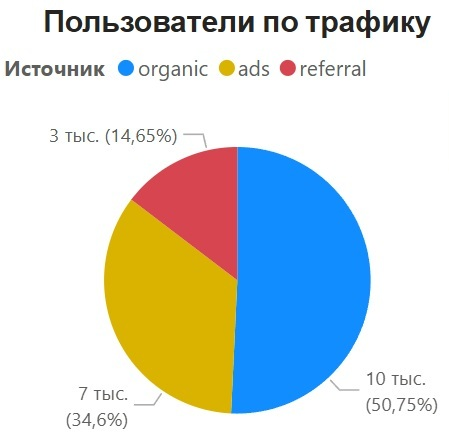
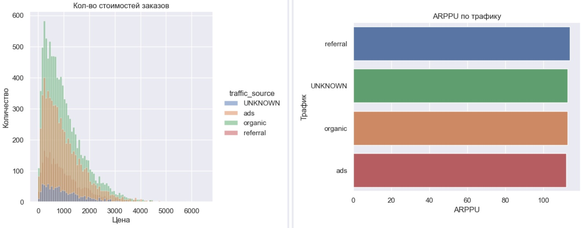
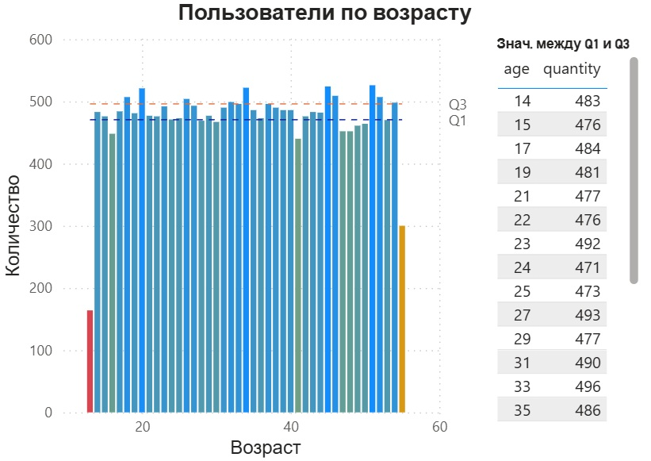
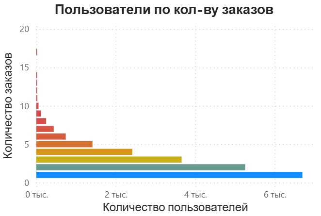
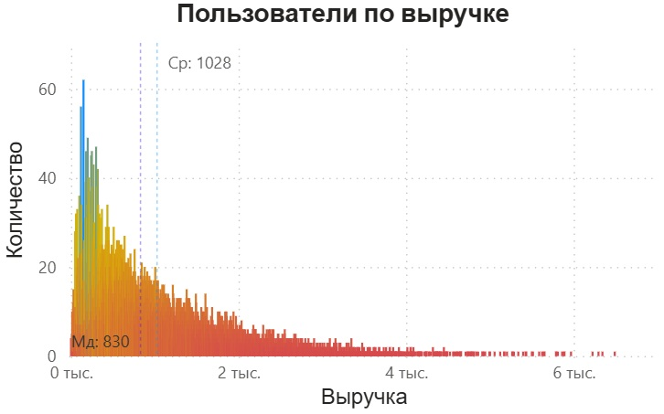
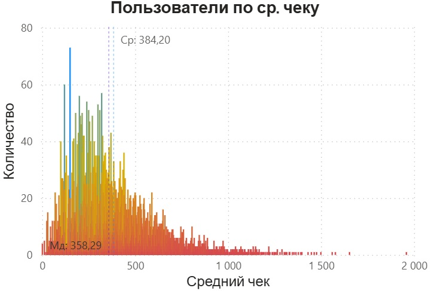
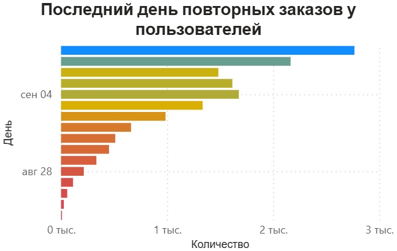
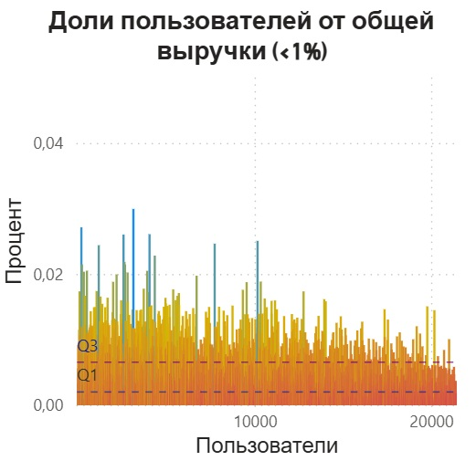

*Оглавление:*
* [[#Трафик]]
* [[#Аномалии]]
* [[#Возраст пользователей]]
* [[#Кол-во заказов]]
* [[#Общая выручка и средний чек]]
* [[#Повторные заказы]]
* [[#Доли пользователей от выручки]]
* [[#Предварительный Дашборд]]

 

# Трафик

Можно отметить, что **большая часть** пользователей появляется через **"сарафанное радио"**. Предварительно, **это** можно отметить как **+**. Такие пользовать обычно **более лояльны** к продукту, **нежели** чем те, которые узнали о нём **через рекламу**. Но нельзя исключать вероятность того, что часть людей **попала в органику через рекламу**, просто найдя сайт своими силами

**Реферальных** меньше всего. В теории, пользователи полученные таким способом **должны быть** ещё **лояльнее**, чем **органические**, поскольку рекламой выступают их знакомые и близкие
 

## ARPPU

По графикам распределения и полученным ARPPU уже можно говорить, что с большой доле вероятности **отличий между трафиками по ARPPU нет**. Об этом косвенно говорят и графики, расположенные один над другим (кол-во цен и их распределение лежат довольно пропорционально) и на вид низкая разница между ARPPU.

Если **выбирать** какой-то один **трафик** для развития и масштабирования, то ближе всего к этому - **реклама**. Органический трафик складывается из факторов, которые представляют большую совокупность:
* имидж компании
* её узнаваемость
* устные рекомендации пользователей
* таже реклама, услышанная давно
* и прочее
**В отличии от органики**, её проще *улучшать* и *масштабировать*. На это понадобиться меньше ресурсов.
 
Однако, **выбор может легко измениться на органический источник**, если есть чёткое понимание о том, откуда он пришёл. Это может быть какой-нибудь *инфоповод*:
* крупное/привлекающее внимание событие
* появление в массовых TV и интернет СМИ
* материал блогера
* и прочее

В таком случае есть явная причина на которую можно повлиять и в таком случае **есть смысл сменить вектор на органических пользователей**

 

# Аномалии
## Даты регистраций пользователей

Даты первой регистрации в каждом месяце:
- 2022-01-08
- 2022-02-08
- 2022-03-08
- 2022-04-08
- 2022-05-08
- 2022-06-08
- 2022-07-08
- 2022-08-08

Выходит довольно необычный график регистраций. **Рост в течении одного дня**, а затем **полное плато** до момента новой волны регистраций. Подобное поведение можно было бы объяснить **потоковой регистрацией**, когда окно этих самых регистраций открыто в определённый промежуток времени. **Нетипичный подход для Ecommerce**. **Можно предположить, что есть проблемы со сбором данных**. Однако стоит учитывать, что **каждая новая волна начинается 8 числа каждого месяца и длится день**. Подобные обстоятельства могут действительно **является стратегией** компании. Данная ситуация требует уточнений и разбирательств о природе подобного поведения графика
 
## Конверсия 99%

| event_type   | quantity | relative_previous_value | relative_max_value |
| :----------- | :------- | :---------------------- | :----------------- |
| registration | 21401    | 1.00                    | 1.00               |
| view_product | 21401    | 1.00                    | 1.00               |
| add_to_cart  | 21401    | 1.00                    | 1.00               |
| purchase     | 21088    | 0.99                    | 0.99               |

Снова необычная ситуация. **Подобная конверсия**, мягко говоря, **редкость**. Это либо снова закономерность политики компании, либо ошибка в данных.
**Подобное поведение** может быть **следствием** каких-нибудь **ивентов** на подобие **больших акций/бонусов** и/или **скидок** на товары в периоды окон регистрации. Т.е. во время того, как открывается возможность зарегистрироваться (8 число каждого месяца) на сайте проходят масштабные акции. Подобная гипотеза требует проверки
 
## Отсутствие данных о пользователях

| traffic_source | event_type   | quantity | relative_previous_value | relative_max_value |
| :------------- | :----------- | :------- | :---------------------- | :----------------- |
| ads            | registration | 7035     | 1.00                    | 1.00               |
| ads            | view_product | 7035     | 1.00                    | 1.00               |
| ads            | add_to_cart  | 7035     | 1.00                    | 1.00               |
| ads            | purchase     | 6921     | 0.98                    | 0.98               |
| organic        | registration | 10318    | 1.00                    | 1.00               |
| organic        | view_product | 10318    | 1.00                    | 1.00               |
| organic        | add_to_cart  | 10318    | 1.00                    | 1.00               |
| organic        | purchase     | 10178    | 0.99                    | 0.99               |
| referral       | registration | 2978     | 1.00                    | 1.00               |
| referral       | view_product | 2978     | 1.00                    | 1.00               |
| referral       | add_to_cart  | 2978     | 1.00                    | 1.00               |
| referral       | purchase     | 2935     | 0.99                    | 0.99               |
| UNKNOWN        | registration | 1070     | 1.00                    | 1.00               |
| UNKNOWN        | view_product | 1070     | 1.00                    | 1.00               |
| UNKNOWN        | add_to_cart  | 1070     | 1.00                    | 1.00               |
| UNKNOWN        | purchase     | 1054     | 0.99                    | 0.99               |

При расчётах была **обнаружена аномалия** в данных. Далеко **не все пользователи**, совершившие покупку **присутствуют в таблице `users`**. Из-за этого некоторые столбцы имеют пропущенные значения, заменённые на `UNKNOWN`
 
# Возраст пользователей

Наблюдается **условно ровный график** возрастов (за исключением **выбросов** на *13* и *55* годах). **IQR** выходит небольшой, примерно **33** чел. при **медиане** примерно в **485** чел.
Можно выделить следующие **группы возрастов**:
* *13 - 20*
* *21 - 30*
* *31 - 40* - самая "ровная" группа со значениями, приближенными к Q3
* *41 - 46*
* *47 - 52*
* *53 - 55*
 

# Кол-во заказов

Довольно **закономерный график**. Людей с большим кол-вом заказов меньше, чем с малым. Правда **видна одна странность**, наблюдаемая в предыдущих наблюдениях: **полное отсутствие пользователей не делающих покупок**
 

# Общая выручка и средний чек
## Выручка

Наблюдается график с **правосторонней асимметрией**. Для графиков выручки асимметрия так же является вполне нормальным явлением.
Можно на основе этих данных провести анализ, а именно выяснить **какая из групп больше всего приносит прибыль**: **левая** (*больше людей, меньше тратят*) или *правая* (*меньше людей, больше тратят*) часть и на основе этих данных решить какая из групп **потенциально принесёт больше прибыли** при подогреве их интересов акциями, бонусами, программами лояльности и прочим

## Средний чек

Похожая ситуация с предыдущим графиком. Так же **правосторонняя асимметрией**, но из-за более **плотной левой стороны** ***медиана*** и ***среднее*** ближе к пику и между собой 
 

# Повторные заказы

**Убрав** из выборки **новых пользователей** (те, у кого *кол-во заказов = 1*) можно оценить когда в **последний** раз производился **повторный заказ**. Исходя из графика можно сделать вывод, что **большая часть пользователей** склонна **повторно делать заказы**. Скорее всего это связано с гипотетическими ивентами и акциями, проводимыми компанией
 

# Доли пользователей от выручки

**Процент**, как и количество **выбросов** довольно **мал**. Тем не менее, **основываясь на этом графике и графике выручки**, можно также создавать **программу лояльности** с постоянной скидкой для **клиентов с большим и средним процентом**. И обратное, для людей с **меньшим процентом** предлагать **промокоды**, **бонусы** и другие способы работы с малоактивными клиентами
 

# Предварительный Дашборд

